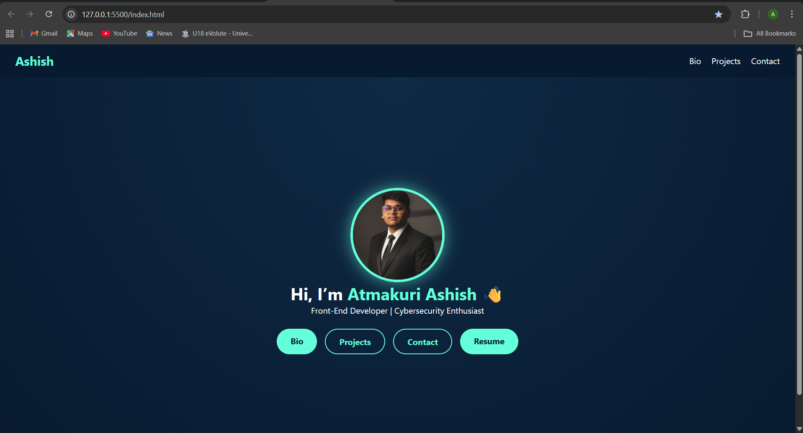
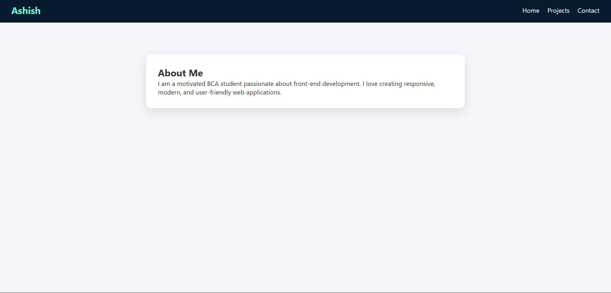

# 🌐 Personal Portfolio Website

This is my **personal portfolio website** built using **HTML, CSS, and JavaScript**.  
It showcases my profile, skills, projects, and contact details in a clean and simple design.

---

## 👨‍💻 About Me

I am **Atmakuri Ashish**, a BCA student and aspiring **Front-End Developer**.  
I enjoy creating simple, responsive, and user-friendly web interfaces and continuously improving my technical skills.

---

## ✨ Features

- ✅ Multi-page website (Home, Bio, Projects, Contact)
- 🌙 Light / Dark mode toggle
- 📄 Resume download option
- 📞 Click-to-call & WhatsApp chat
- 🔗 LinkedIn and GitHub profile links
- 📱 Responsive and beginner-friendly design

---

## 🛠️ Technologies Used

- **HTML5**
- **CSS3**
- **JavaScript**

---

## 📂 Project Structure

---

## 🚀 Live Demo

🔗 **Live Website:**  
https://atk-007.github.io/personal-portfolio/

---

## 📬 Contact

- **Email:** ashishatmakuri05@gmail.com  
- **Phone:** +91 7064936270  
- **LinkedIn:** https://www.linkedin.com/in/atmakuri-ashish-076a03321  
- **GitHub:** https://github.com/ATK-007  

---

## 📸 Screenshots

### 🏠 Home Page

### 👤 Bio Page

### 🚀 Projects Page

### 📞 Contact Page

---

⭐ If you like this project, feel free to star the repository!
